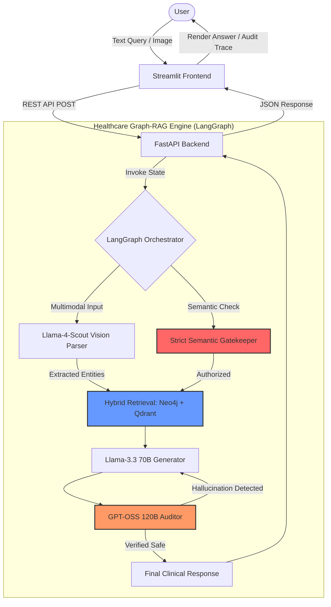

# Healthcare Graph-RAG v2: Adversarial CDSS

A production-grade, decoupled Clinical Decision Support System (CDSS) utilizing Hybrid RAG (Graph + Vector), Multimodal Vision Parsing, and an Adversarial Self-Auditing Loop.

### 🖼️ System Architecture Diagram



## 🏗️ Architecture: Decoupled Microservices
The system is built as a microservices architecture to ensure scalability and maintainability.

- **Backend API (FastAPI):** Orchestrates the LangGraph reasoning engine, Neo4j graph traversals, and Qdrant vector retrieval.
- **Frontend UI (Streamlit):** A lightweight client that communicates with the backend via REST API.
- **Reasoning Engine (LangGraph):** A stateful graph that manages semantic gatekeeping, data extraction, and multi-step clinical reasoning.

## 🛡️ Key Technical Pillars

### 1. Adversarial Safety Loop (The Auditor)
Unlike standard RAG, this system uses an **Adversarial Audit Loop**. Every clinical response generated by the primary model (Llama-3.3-70B) is intercepted and audited by a secondary high-reasoning model (GPT-OSS-120B). 
- If the auditor detects a hallucination or missing contraindication, it triggers a **recursive retry**.
- This ensures the output is verified against clinical evidence before reaching the user.

### 2. Hybrid RAG (Neo4j + Qdrant)
The system synchronizes structured medical relationships (Neo4j) with unstructured clinical documentation (Qdrant). This allows for:
- **Relational Discovery:** Identifying alternative drugs (e.g., Losartan vs. Lisinopril).
- **Semantic Search:** Retrieving specific guidelines from dense medical PDFs.

### 3. Multimodal Clinical Parsing
Integrated **Llama-4-Scout** vision parsing allows users to upload raw screenshots of lab reports or clinical notes. The system extracts medical entities (Diseases, Drugs, Biomarkers) directly from imagery and injects them into the retrieval pipeline.

## 📂 Project Structure
```text
HEALTHCAREGRAPHRAGV2/
├── api/                    # FastAPI REST Backend
│   └── main.py             # API Endpoints & Route logic
├── core/                   # The Reasoning Engine
│   ├── graph_engine.py     # LangGraph Logic & Hybrid RAG
│   └── vision_parser.py    # Multimodal Llama-4 Parsing
├── eval/                   # MLOps & Benchmarking
│   └── evaluate_model.py   # Automated Stress-Testing Suite
├── frontend/               # Presentation Layer
│   └── app.py              # Streamlit UI
├── ingest_data.py          # Data Ingestion (Neo4j/Qdrant)
└── requirements.txt        # Dependency Management
```

## 🚀 Setup & Execution

1. Install Dependencies

```bash
pip install -r requirements.txt
```

2. Start the Backend (API)

``bash
uvicorn api.main:app --port 8000
```

3. Start the Frontend (UI)
```bash
streamlit run frontend/app.py
```

4. Run Automated Evaluation
```bash
python eval/evaluate_model.py
```

## 📊 Performance Metrics

The system was benchmarked against four clinical query categories:

Standard Clinical: 100% Retrieval Match.

Off-Topic Guardrail: 100% Rejection Rate (0 tokens wasted on LLM generation).

Adversarial Safety: 100% Detection of clinical contradictions (triggered Loop 2).


